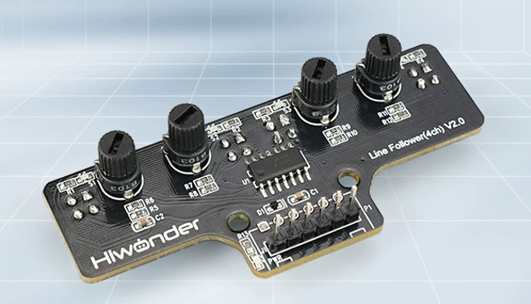
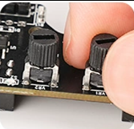
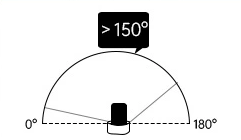
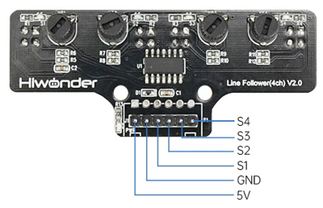

# 1. 4-Ch Line Follower Sensor Overview

[TOC]

## 1.1 Product Overview

The 4-ch line follower sensor uses miniature high-precision infrared probes to deliver accurate grayscale sensing across a detection range of 1 mm to 10 cm.

The module also features four onboard sensitivity adjustment knobs, each with an adjustment range of 150 degrees. When installed on a robot, the 4-ch line follower sensor supports advanced line following tasks, including right-angle turns, intersections, sharp U-turns, cross intersections, and T-junction detection. This module is well-suited for the development and expansion of a wide range of smart vehicles, including two-wheel drive, four-wheel differential-drive, Mecanum-wheel, omnidirectional-wheel, and Ackermann robots.

## 1.2 Working Principle

The 4-ch line follower sensor operates on infrared detection. The sensor includes four probes. Each probe consists of one infrared transmitter and one infrared receiver.

Stronger infrared reflection from white surfaces produces a higher output. Weaker infrared reflection from black surfaces produces a lower output. As a probe moves closer to a black line, the output becomes lower. The distance to the black line can therefore be determined from the analog output. A smaller reading indicates that the corresponding sensor is closer to the black line. Sensor sensitivity can be adjusted with the onboard knobs. Turning a knob clockwise increases sensitivity. Turning it counterclockwise decreases sensitivity.

This sensor can distinguish between black and white lines and is suitable for line following on smart vehicles and robots, including more complex routes. The spacing of the four sensing probes has also been carefully optimized. The two inner probes provide accurate detection while staying within the black line area. The two outer probes can detect black lines on wide curves in advance and provide an early warning. Key advantages include fast detection speed and strong adaptability.

## 1.3 Module Specifications

### 1.3.1 Specifications

|          Item          |                        Specification                         |
| :--------------------: | :----------------------------------------------------------: |
|   Operating Voltage    |                         3.3 V to 5 V                         |
|   Operating Current    |                        10 mA to 50 mA                        |
| Operating Temperature  |                        -10°C to 50°C                         |
| Sensitivity Adjustment |  Miniature potentiometer adjustment with four rotary knobs   |
|   Detection Distance   |                Adjustable from 1 mm to 10 cm                 |
|  Recommended Distance  |                        Around 0.8 cm                         |
|  Communication Method  |                          GPIO input                          |
|    Output Interface    | S1, S2, S3, and S4 are the four channels. - is the negative power terminal. + is the positive power terminal. |
|     PWR Indicator      |           Lights up after the sensor is powered on           |

The sensor includes four probes. Each probe contains one infrared transmitter and one infrared receiver. All four probes operate independently.

> [!NOTE]
>
> **The detection distance can be adjusted with the knobs. Sensitivity can be tuned for different environments by adjusting the detection distance. The effective adjustment range is 150 degrees, as shown in the figure.**

## 1.4 Pin Description

The figure below shows each pin.

| Pin  | Description  |
| :--: | :----------: |
|  5V  | Power input  |
| GND  | Power ground |
|  S1  |   I/O port   |
|  S2  |   I/O port   |
|  S3  |   I/O port   |
|  S4  |   I/O port   |

> [!NOTE]
>
> **The wiring must be connected exactly as shown in the tutorial.**