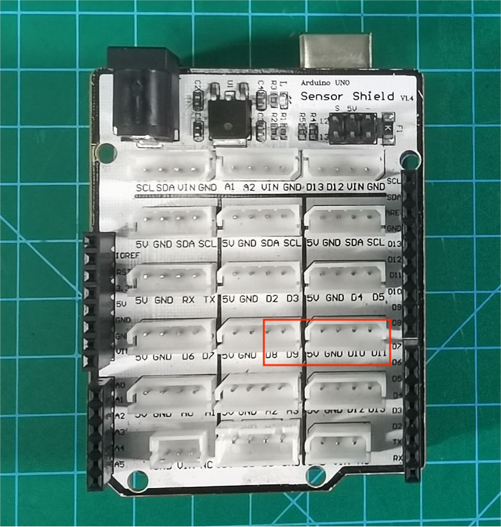
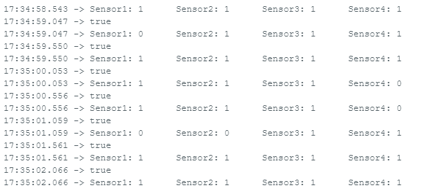
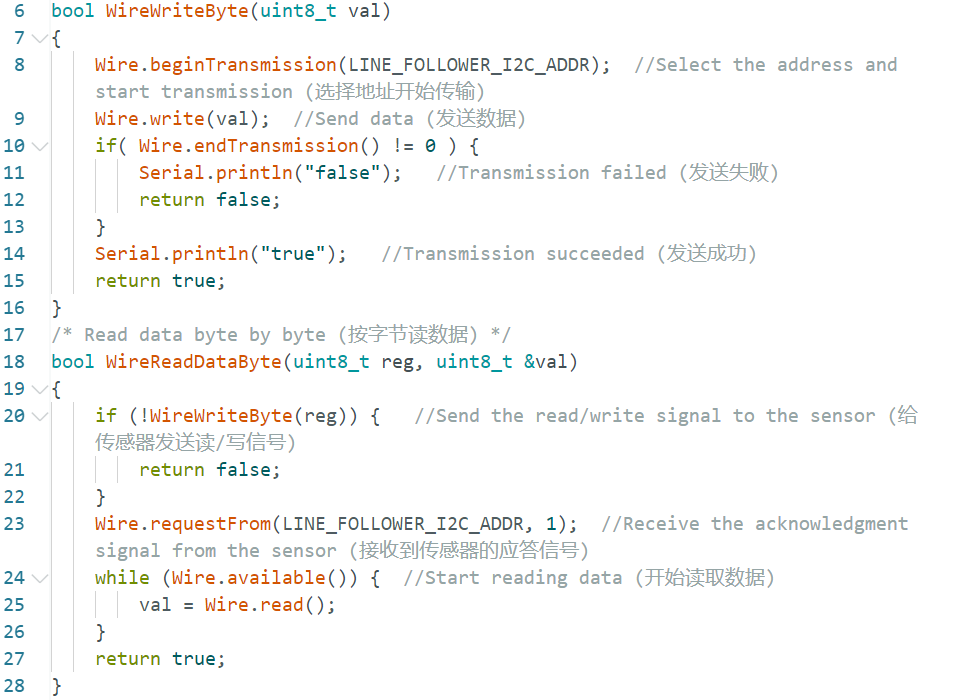
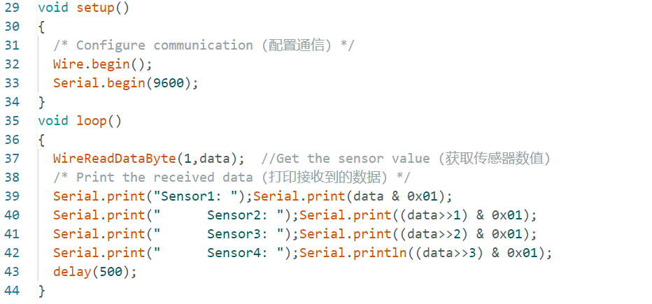

# 2. Arduino Example

## 2.1 Preparation

An Arduino UNO and an expansion board are used in this example. Connect the 4-ch line follower sensor to the 5V pin, GND pin, and four IO pins on the expansion board with a 6P cable.

| Pin  | Description  |
| :--: | :----------: |
|  5V  | Power input  |
| GND  | Power ground |
|  S1  |      D4      |
|  S2  |      D5      |
|  S3  |      D3      |
|  S4  |      D2      |

> [!NOTE]
>
> **The detection distance can be adjusted with the knobs, allowing the sensitivity to be tuned for different environments. For calibration, first place the infrared probes over a black area and adjust the knobs until all blue indicator lights turn on. Then slowly rotate the knobs until the lights just turn off. Next, place the probes over a white area and continue adjusting until the lights just turn on. The probes are now set to the optimal sensitivity, as shown in the figure.**

## 2.2 Example Program

The 4-ch line follower sensor works by infrared detection. It has four probes, and each probe includes one transmitter and one receiver.

1. Connect the Arduino UNO with the expansion board installed to the computer with a USB cable.

2. Open the Arduino example sketch in the [01 Arduino](https://drive.google.com/drive/folders/1wAH4bbi8OJHzqooWtr-qJ8P4QdlaKFJ4?usp=sharing) folder.

3. Select the correct board and port. This example is demonstrated with an Arduino UNO on Port 11. Select the port that matches the connected board.

## 2.3 Program Outcome

1. Suitable platforms include Mecanum-wheel, differential-drive, tank, and Ackermann chassis.

2. Prepare a sheet of white paper with a black line, or draw several black lines on white paper.

3. Place the sensor probes over the black line and the white background, then open the **Serial Monitor** in the Arduino IDE. The readings from the four probes are displayed as `1` or `0`. When a probe is over a black line, the corresponding indicator turns off, and the reading is `0`. When a probe is over a white area, the corresponding indicator turns on, and the reading is `1`. 

## 2.4 Program Analysis

The program uses four line following channels to detect the black line and outputs the logic levels of each channel through the serial port. A reading of `0` indicates that the corresponding probe is over a black line. A reading of `1` indicates that the corresponding probe is over a white area. The program is shown in the figure below.

