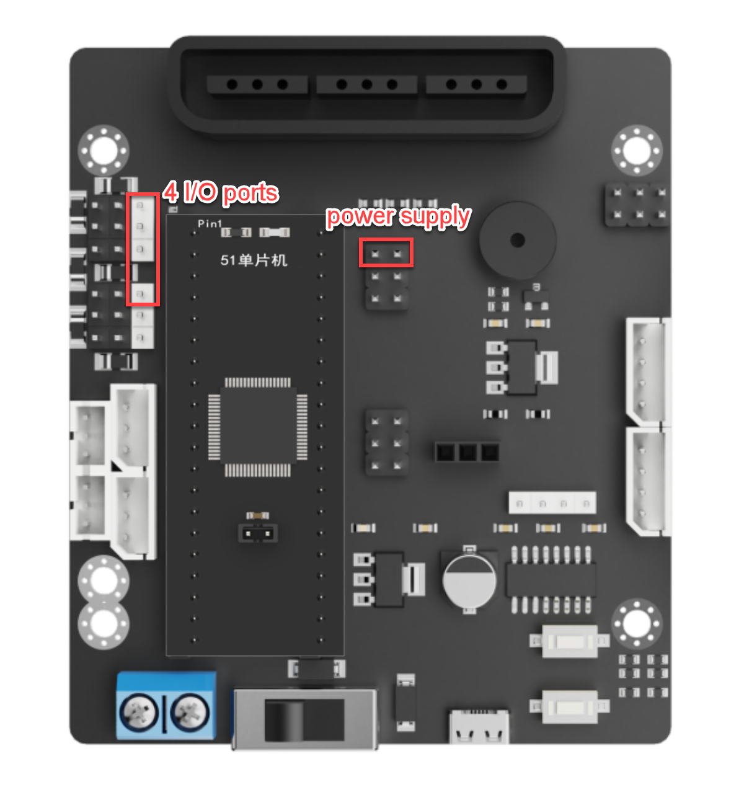
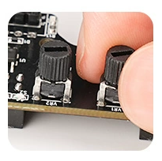
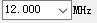
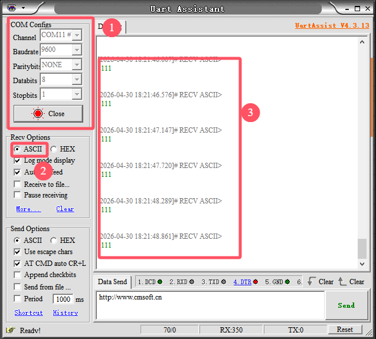
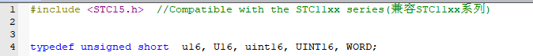
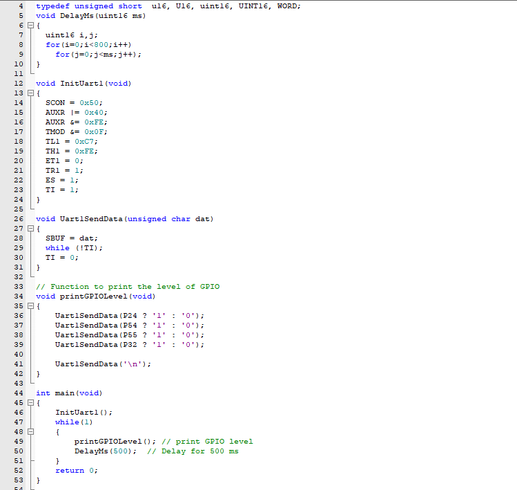

# 3. C51 Example

## 3.1 Preparation

This example uses the **STC15W4K16S4** main control chip with an open-source servo controller expansion board. Connect the 4-ch line follower sensor to the 5V pin, GND pin, and four IO pins on the expansion board with a 6P cable.

| Pin  | Description  |
| :--: | :----------: |
|  5V  | Power input  |
| GND  | Power ground |
|  S1  |     P24      |
|  S2  |     P54      |
|  S3  |     P55      |
|  S4  |     P32      |

> [!NOTE]
>
> **The detection distance can be adjusted with the knobs, allowing the sensitivity to be tuned for different environments. For calibration, first place the infrared probes over a black area and adjust the knobs until all blue indicator lights turn on. Then slowly rotate the knobs until the lights just turn off. Next, place the probes over a white area and continue adjusting until the lights just turn on. The probes are now set to the optimal sensitivity, as shown in the figure.**

## 3.2 Example Program

The 4-ch line follower sensor operates by infrared detection. It includes four probes, and each probe contains one transmitter and one receiver.

1. Connect the development board with the expansion board installed to the computer with a USB cable, or use the extended serial port.

2. Open the C51 example program in the **Example Program** folder. For program download, refer to **[2. Softwares/01 C51 Tool/Set Development Environment](https://drive.google.com/drive/folders/14Vqtvup7l7_GOG_bX5j2_-xE8iwDuLqN?usp=sharing)**. During programming, select the correct option and use the value that matches the detected frequency.

## 3.3 Program Outcome

1. Applicable platforms include Mecanum-wheel, differential-drive, tank, and Ackermann chassis.

2. Prepare a sheet of white paper with a black line, or draw several black lines on white paper.

3. Place the sensor probes over the black line and the white background, then open the **Serial Monitor** in the IDE. The readings from the four probes are displayed as `1` or `0`. When a probe is over a black line, the corresponding indicator turns off, and the reading is `1`. When a probe is over a white area, the corresponding indicator turns on, and the reading is `0`. Make sure the serial port settings are correct.

## 3.4 Program Analysis

The program uses four line following channels to detect the black line and outputs the logic levels of each channel through the serial port. A reading of `1` indicates that the corresponding probe is over a black line. A reading of `0` indicates that the corresponding probe is over a white area. The program is shown in the figure below.

