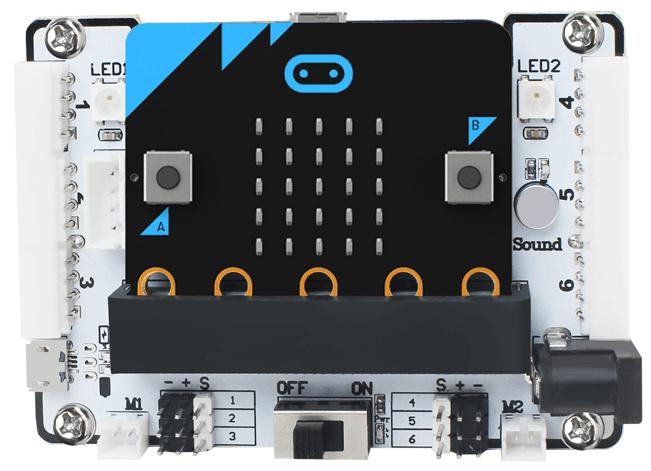

# 4. micro:bit Example

## 4.1 Preparation

A micro:bit board and a micro:bit expansion board are used in this example. Connect the 4-ch line follower sensor to Port 4 on the micro:bit expansion board with a 4P cable.

| Pin  | Description  |
| :--: | :----------: |
|  5V  | Power input  |
| GND  | Power ground |
|  S1  |      P1      |
|  S2  |      P2      |
|  S3  |     P13      |
|  S4  |     P14      |

> [!NOTE]
>
> **The detection distance can be adjusted with the knobs, allowing the sensitivity to be tuned for different environments. For calibration, first place the infrared probes over a black area and adjust the knobs until all blue indicator lights turn on. Then slowly rotate the knobs until the lights just turn off. Next, place the probes over a white area and continue adjusting until the lights just turn on. The probes are now set to the optimal sensitivity, as shown in the figure.**

## 4.2 Example Program

The 4-ch line follower sensor operates by infrared detection. It includes four probes, and each probe contains one transmitter and one receiver.

1. Open the official [micro:bit online programming platform](https://makecode.microbit.org/).

2. Click the button shown on the webpage as illustrated below, or drag the example micro:bit program directly into the page.

3. Connect the micro:bit board to any USB port on the computer, then download the program to the micro:bit drive for that board.

4. After the download is complete, insert the micro:bit board into the micro:bit expansion board.

## 4.3 Program Outcome

1. Prepare a sheet of white paper with a black line, or draw several black lines on white paper.

2. Place the sensor probes over the black line and the white background. The micro:bit board will display `01234` on the LED matrix.