# 5. STM32 Example

[TOC]

## 5.1 Program Path

The source code for this section is located in [3. Example Program\04 STM32\rosrobotcontrollerm4\Hiwonder\System\line_follower.c](https://drive.google.com/drive/folders/1JLYz9dkVzSFnhPxKPBtufmKAGgX7gxhH?usp=sharing).

Open the project file with **Keil5**. Installation details for the software can be found in the directory [2. Softwares\05 STM32 Tool\Set Development Environment](https://drive.google.com/drive/folders/1ZTW-E3Hhul1iq4YMXpTD9fDCfKm4EjnA?usp=sharing).

## 5.2 Hardware Connections

**1. STM32 Controller**

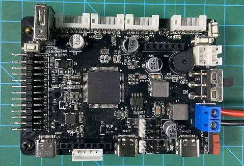

**2. 4-ch Line Follower Sensor**

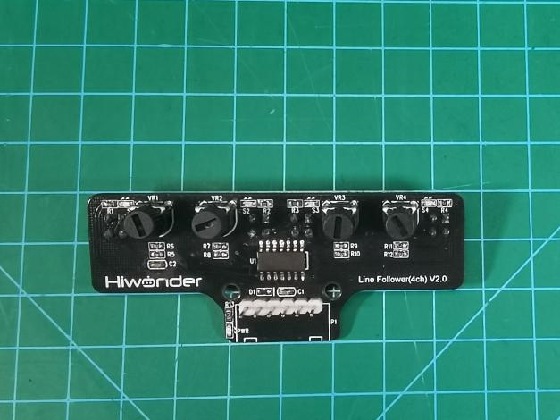

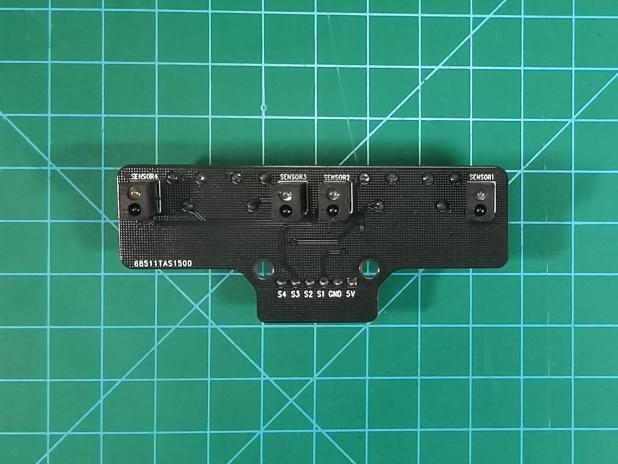

### 5.2 Interface Description

| Pin  | Description  |
| :--: | :----------: |
|  5V  | Power input  |
| GND  | Power ground |
|  S1  |     PC1      |
|  S2  |     PC0      |
|  S3  |     PE3      |
|  S4  |     PE2      |

## 5.3 Program Outcome

Use **J-Link RTT Viewer** to display the output, as shown in the figure below.

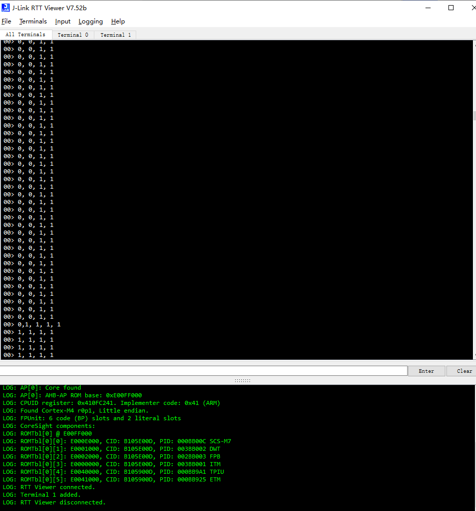

The printed values `0` and `1` indicate whether the four line following channels are detecting the black line or the white surface.

## 5.4 Specifications

|          Item          |                        Specification                         |
| :--------------------: | :----------------------------------------------------------: |
|   Operating voltage    |                            DC 5 V                            |
|   Operating current    |                            140 mA                            |
| Operating temperature  |                         0°C to 50°C                          |
| Sensitivity adjustment |              Miniature potentiometer adjustment              |
|  Communication method  |                          GPIO input                          |
|     PWR indicator      |               Lights up after power is applied               |
|         Probe          | The sensor has four probes. Each probe includes one infrared transmitter and one infrared receiver. |
|    Operating method    |            All four probes operate independently.            |

## 5.5 Source Code Analysis

The program uses the **STM32F4 HAL** library to configure `PC0`, `PC1`, `PE2`, and `PE3` on the `STM32F407VET6` as input pins for detection, as shown in the figure below.

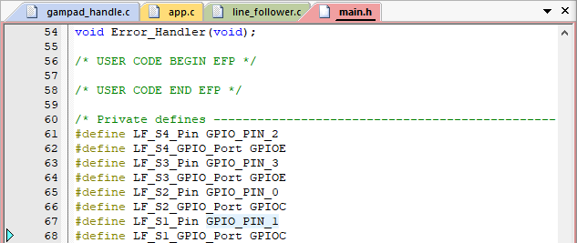

* **PID Control**

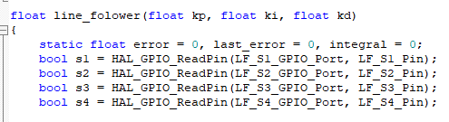

The program reads the state of each line following channel and stores each result in a Boolean variable named `s1`, `s2`, `s3`, and `s4`.

The `line_follower` function has three parameters, which represent the proportional, integral, and derivative coefficients of the PID controller.

Three static floating-point variables are defined:

`error`, the current error

`last_error`, the previous error

`integral`, the accumulated error

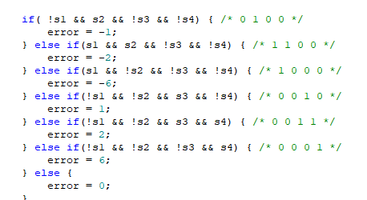

The `if-else` logic calculates the error value based on the states of the four line following channels.

Each condition corresponds to a specific sensor combination and produces a different error value. A more detailed explanation is provided below.

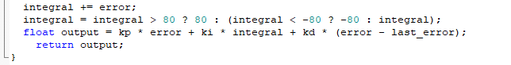

The function returns the output of the PID controller. This output is then used to adjust the angular velocity of the chassis so the vehicle can stay on the line.

The program also calculates the accumulated error with `integral += error`, then limits the integral value to the range from `-80` to `80`.

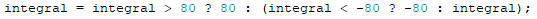

This limit prevents the integral term from becoming too large, and the value is limited to the range from `-80` to `80`.

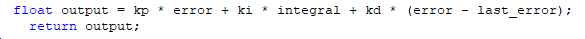

The PID output is calculated with `kp`, `ki`, and `kd`, which are the proportional, integral, and derivative coefficients. The returned output is then used to adjust the driving direction of the chassis.

`kp * error` is the proportional term. It makes the controller output proportional to the current position offset.

`ki * integral` is the integral term. It makes the controller output proportional to the accumulated offset over time.

`kd * error - last_error` is the derivative term. It makes the controller output proportional to the rate of change of the position offset.

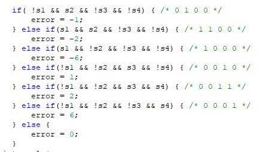

### Detailed Logic Explanation

The following section explains how the code determines the current chassis offset, or error, from the four sensor readings `s1`, `s2`, `s3`, and `s4`.

This error value is then used by the PID controller to adjust the driving direction of the vehicle.

The sensor readings are Boolean values. `true` means the corresponding sensor detects the line, and `false` means no line is detected. In this setup, `s2` and `s3` are positioned at the center of the robot, while `s1` and `s4` are placed on the left and right sides.

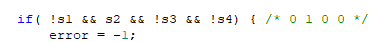

When only `s2` detects the line, the chassis is considered to be offset to the left, so the error is set to `-1`.

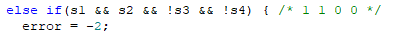

When both `s1` and `s2` detect the line, the chassis is considered to be farther to the left, so the error is set to `-2`.

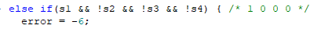

When only `s1` detects the line, the chassis is considered to be heavily offset to the left, so the error is set to `-6`.

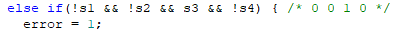

When only `s3` detects the line, the chassis is considered to be offset to the right, so the error is set to `+1`.

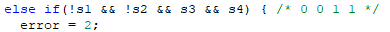

When both `s3` and `s4` detect the line, the chassis is considered to be farther to the right, so the error is set to `+2`.

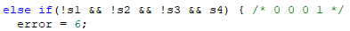

When only `s4` detects the line, the chassis is considered to be heavily offset to the right, so the error is set to `+6`.

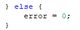

In all other cases, such as when no sensor detects the line or all sensors detect the line, the program treats the chassis as not being offset and sets the error to `0`.

> [!NOTE]
>
> **Do not reverse the positive and negative terminals.**
