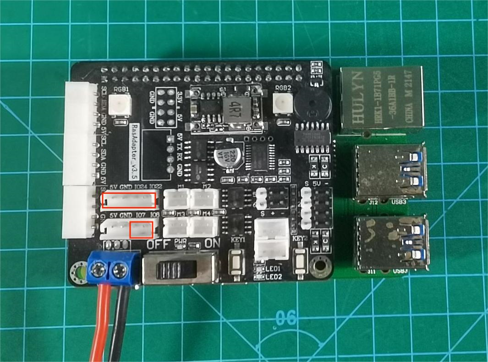
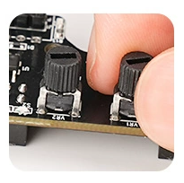
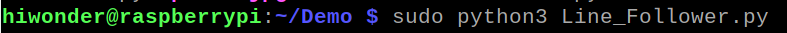
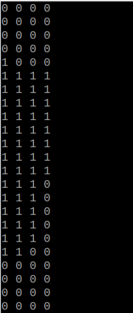
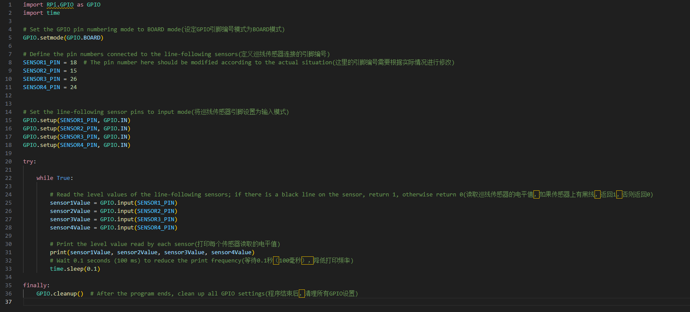

# 6. Raspberry Pi Example

## 6.1 Preparation

A Raspberry Pi 4B and an expansion board are used in this example. Connect the 4-ch line follower sensor to the 5V pin, GND pin, and four IO pins on the Raspberry Pi expansion board with a 6P cable.



| Pin  |      Description      |
| :--: | :-------------------: |
|  5V  |      Power input      |
| GND  |     Power ground      |
|  S1  | GPIO.8, BOARD pin 24  |
|  S2  | GPIO.7, BOARD pin 26  |
|  S3  | GPIO.24, BOARD pin 18 |
|  S4  | GPIO.22, BOARD pin 15 |

> [!NOTE]
>
> **The detection distance can be adjusted with the knobs, allowing the sensitivity to be tuned for different environments. For calibration, first place the infrared probes over a black area and adjust the knobs until all blue indicator lights turn on. Then slowly rotate the knobs until the lights just turn off. Next, place the probes over a white area and continue adjusting until the lights just turn on. The probes are now set to the optimal sensitivity, as shown in the figure.**



## 6.2 Example Program

The 4-ch line follower sensor operates by infrared detection. It includes four probes, and each probe contains one transmitter and one receiver.

1. Use **VNC Viewer** on the computer to connect to the Raspberry Pi.

2. Use **MobaXterm** to upload the Raspberry Pi example program **Line_Follower.py** to the Raspberry Pi.

3. Run the program from the directory where **Line_Follower.py** is stored with the following command:

```bash
sudo python3 Line_Follower.py
```



## 6.3 Program Outcome

1. This section is suitable for Mecanum-wheel, differential-drive, tank, and Ackermann chassis.

2. Prepare a sheet of white paper with a black line, or draw several black lines on white paper.

3. Place the sensor probes over the black line and the white background. The detected values from the four probes are displayed as `1` or `0`. The output can also be viewed in the IDE serial monitor. When a probe is over a black line, the corresponding indicator turns off, and the reading is `0`. When a probe is over a white area, the corresponding indicator turns on, and the reading is `1`.



## 6.4 Program Analysis

The program uses four line following channels to detect the black line and outputs the logic levels of each channel. A reading of `0` indicates that the corresponding probe is over a black line. A reading of `1` indicates that the corresponding probe is over a white area. The program is shown in the figure below.

