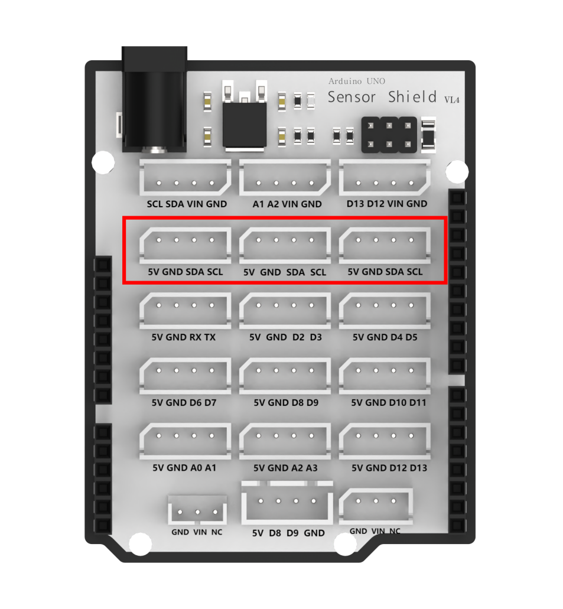
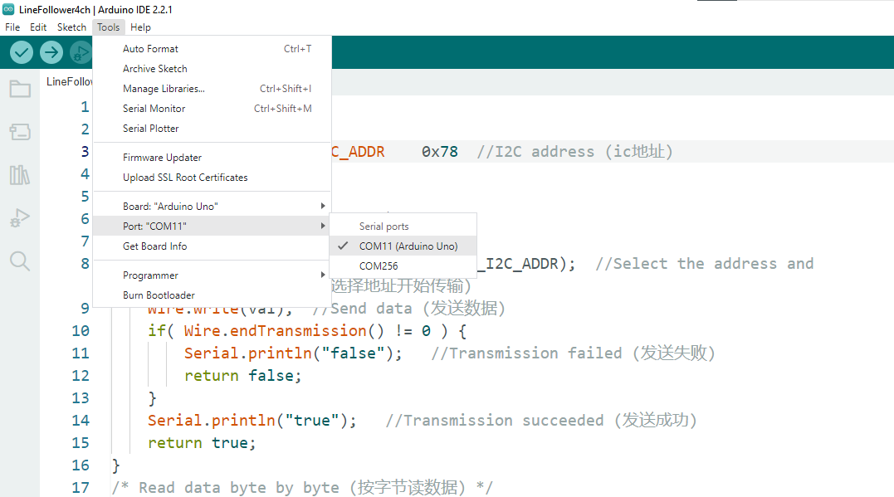
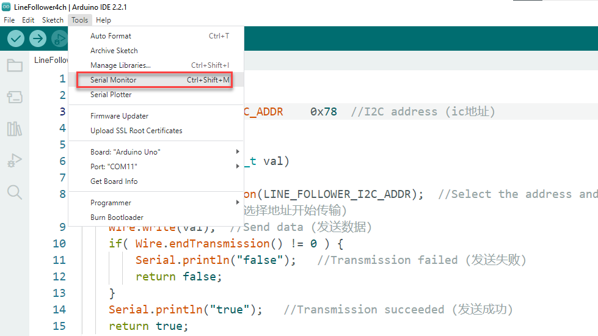
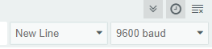
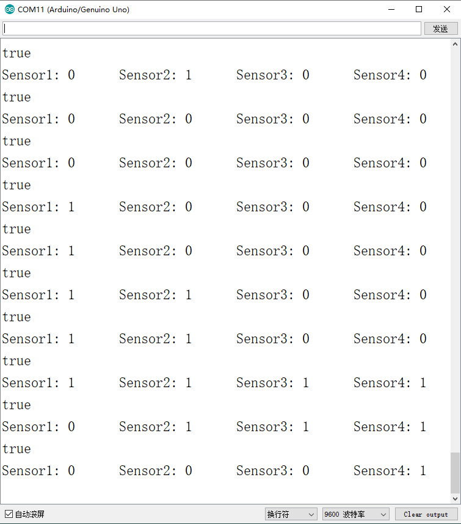
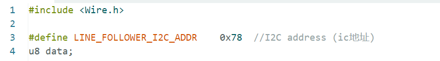

# 2. Arduino Example

[TOC]

## 2.1 Preparation

**1. Wiring and Interface Description**

An Arduino UNO with an expansion board is used in this example. Connect the 4-ch line follower sensor to any available SDA and SCL pin pair on the expansion board using a 4P cable.

| Pin  | Description  |
| :--: | :----------: |
|  5V  | Power input  |
| GND  | Power ground |
| SDA  | Signal line  |
| SCL  |  Clock line  |

**2. Working Principle**

The 4-ch line follower sensor includes four probes. Each probe contains one receiver and one transmitter. After the transmitter emits infrared light, a white surface reflects the infrared light, while a black surface absorbs it. When the receiver detects reflected infrared light, the sensor LED turns on. When no reflected infrared light is detected, the sensor LED turns off.

**3. Sensitivity Adjustment**

The detection distance can be adjusted with the knobs, allowing the sensitivity to be tuned for different environments. For calibration, first place the infrared probes over a black area and adjust the knobs until all blue indicator lights turn on. Then slowly rotate the knobs until the lights just turn off. Next, place the probes over a white area and continue adjusting until the lights just turn on. The probes are now set to the optimal sensitivity, as shown in the figure.

## 2.2 Example Program

1. Connect the Arduino UNO with the expansion board installed to the computer with a USB cable.

2. Open the Arduino example program under [3. Example Program\01 Arduino\LineFollower4ch](https://drive.google.com/drive/folders/1BwtIhfNizuepm-Biuu9WUEFLCTs3ROF-?usp=sharing).

3. Select the correct board and port. This example uses the Arduino UNO. Port 11 is used in the demonstration. Select the actual port according to the setup.

## 2.3 Program Outcome

> [!NOTE]
>
> **This example is suitable for Mecanum-wheel, differential-drive, tank, and Ackermann chassis.**

1. Prepare a sheet of white paper with a black line, or draw several black lines on white paper.

2. Aim the sensor probes at the black and white lines, then open the Serial Monitor in the Arduino IDE. The four probes will print the detected data as `1` or `0`. When a probe detects a black line, the corresponding light turns off, and the displayed value is `0`. When a probe detects a white area, the corresponding light turns on, and the displayed value is `1`. **Set the baud rate to `9600`.**

## 2.4 Program Analysis

First, the UNO sends a read signal to the sensor. After receiving the response signal from the program, the detected data is stored in the `data` variable. The data is then printed bit by bit through the serial port. The specific program is shown in the figure below.

