# 3. C51 Example

[TOC]

## 3.1 Preparation

### 3.1.1 Wiring

During wiring, connect the 5V, GND, SDA, and SCL pins of the 4-ch line follower sensor with a 4-pin cable. The C51 wiring setup is shown in the figure below.

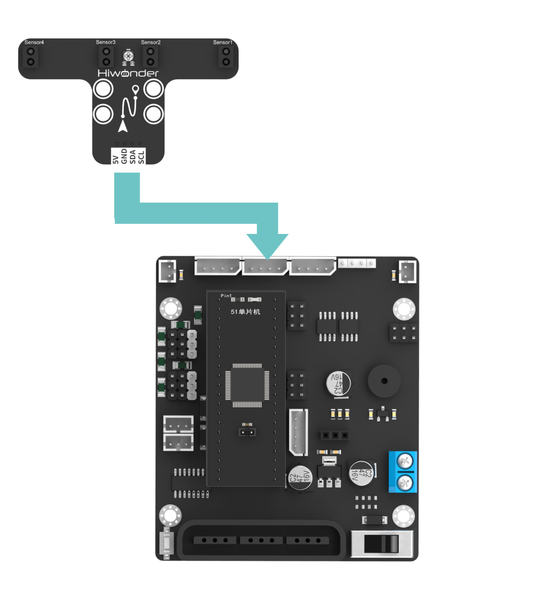

> [!NOTE]
>
> **Before powering on the board, make sure no metal object is in contact with the main board. Otherwise, the pins on the underside of the board may cause a short circuit and damage the board.**

### 3.1.2 Program Download

Before downloading the program, prepare a C51 development board, an open-source robot car controller, Dupont wires, and a USB-to-TTL adapter.

**Download steps**

Connect the control board to any USB port on the computer through the USB-to-TTL adapter.

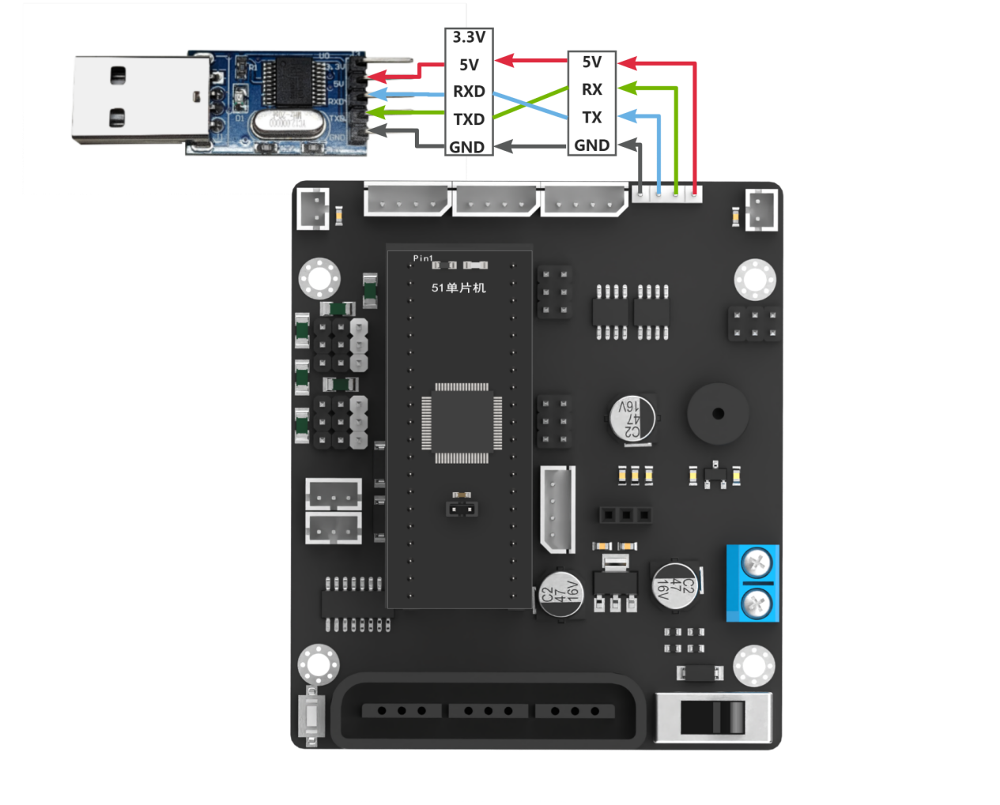

Open the **AIapp-ISP-v6.95E** software.

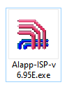

If the software opens in Chinese, click `English` in the red box shown below to switch the interface language to **English**.

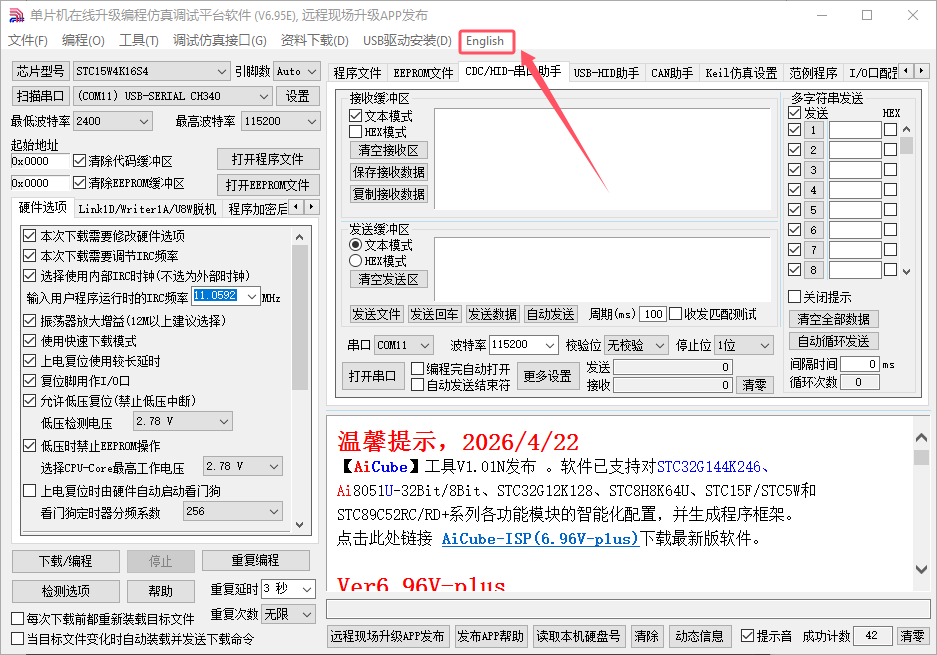

As shown below, click **Scan Port** to detect the serial ports, then select the corresponding port. Port 11 is used here as an example.

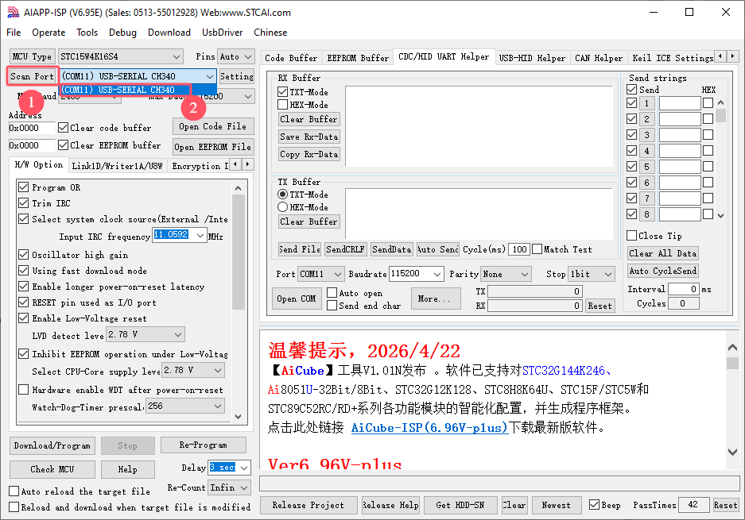

Next, set the baud rate to `115200`.

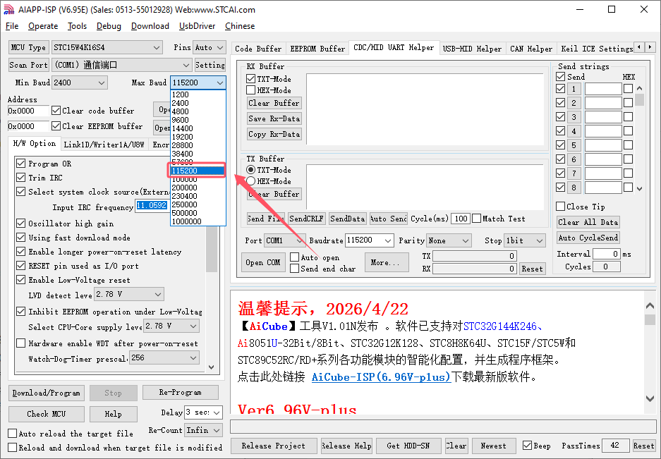

Click **Check MCU** to detect the chip.

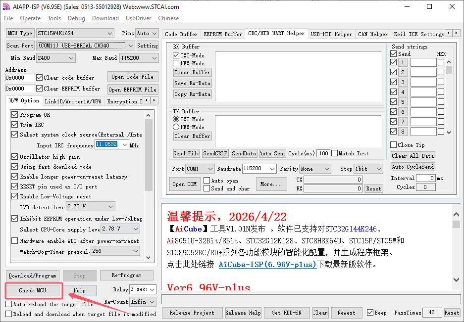

> [!NOTE]
>
> **After the Check MCU button is clicked, the software enters chip connection mode, as shown below. At this point, remove the jumper cap from the main control board. After the jumper cap is removed, the buzzer will sound. Reinstall the jumper cap on the main control board.**
>
> 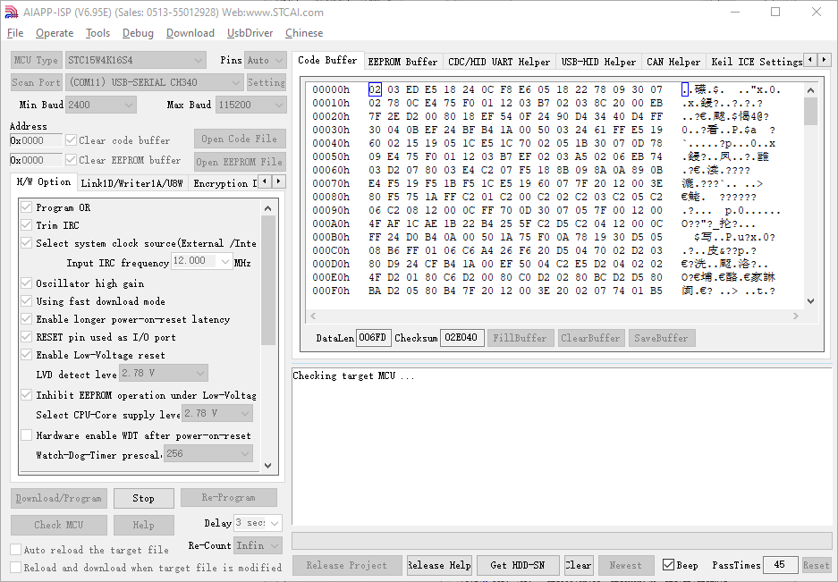

The software will automatically read the chip model.

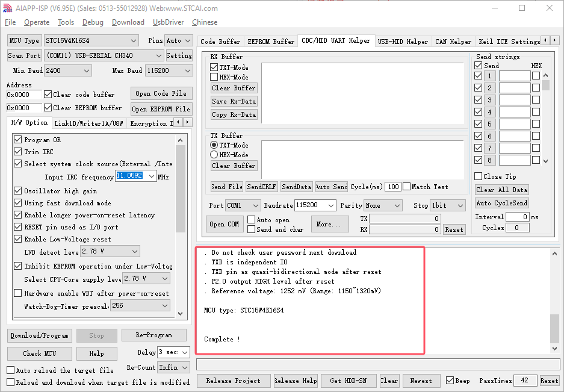

Next, select the required **.hex** firmware file. Click **Open Code File**, choose **LineFollower4ch_C51\Objects\LineFollower4ch_C51.hex**, then click **Open** to load the program file.

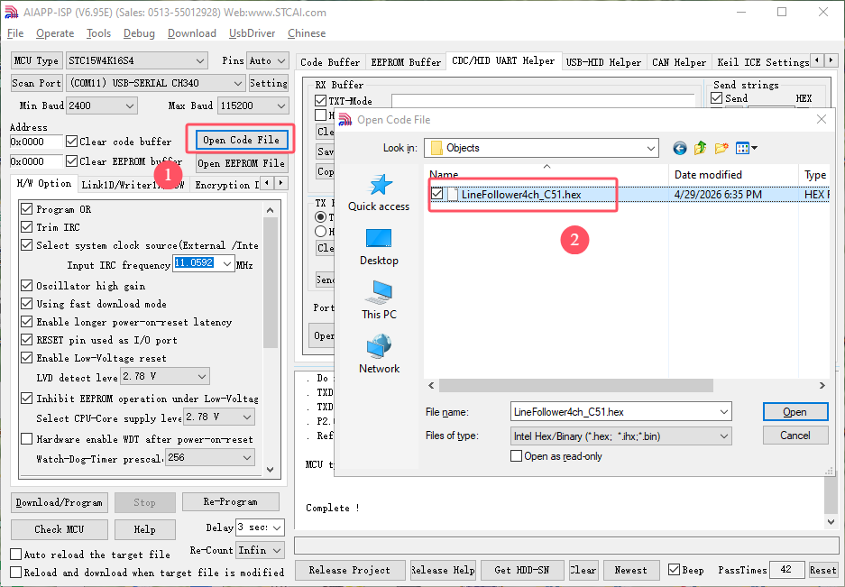

Then set the operating frequency to **12.00Mhz**.

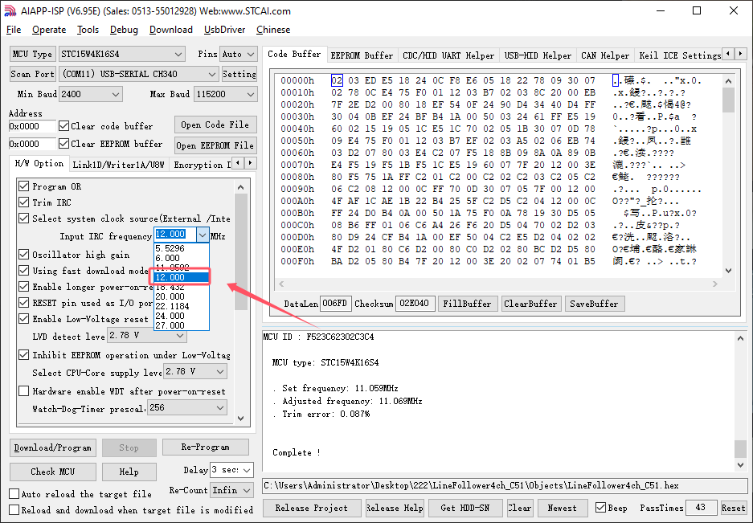

Click **Download/Program** to download the program file to the chip.

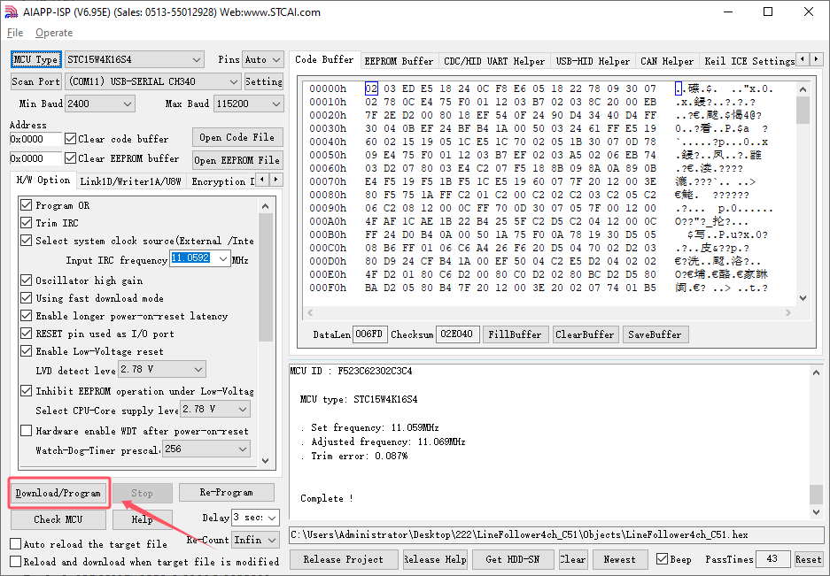

> [!NOTE]
>
> **After the button Download/Program is clicked, the software enters chip connection mode, as shown below. At this point, remove the jumper cap from the main control board. After the jumper cap is removed, the buzzer will sound. Reinstall the jumper cap on the main control board.**
>
> 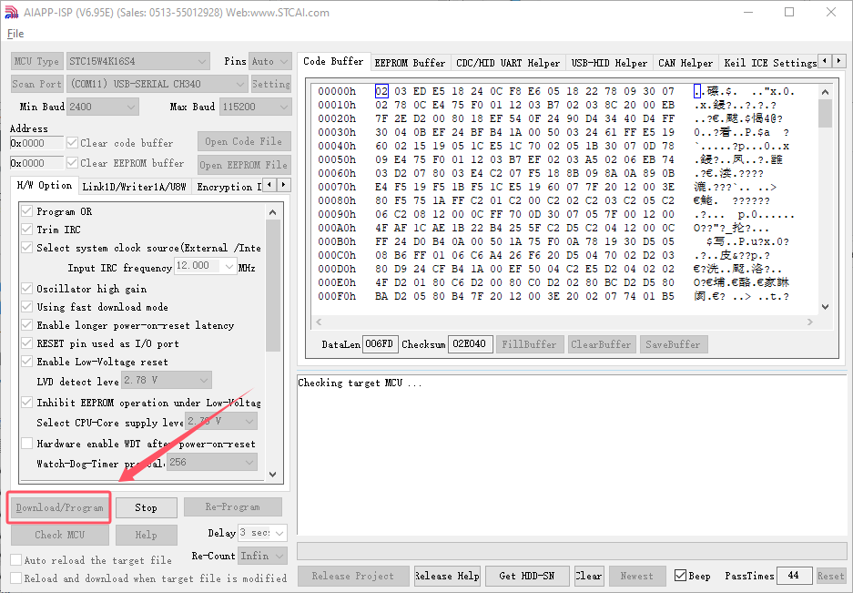

The firmware download is now complete.

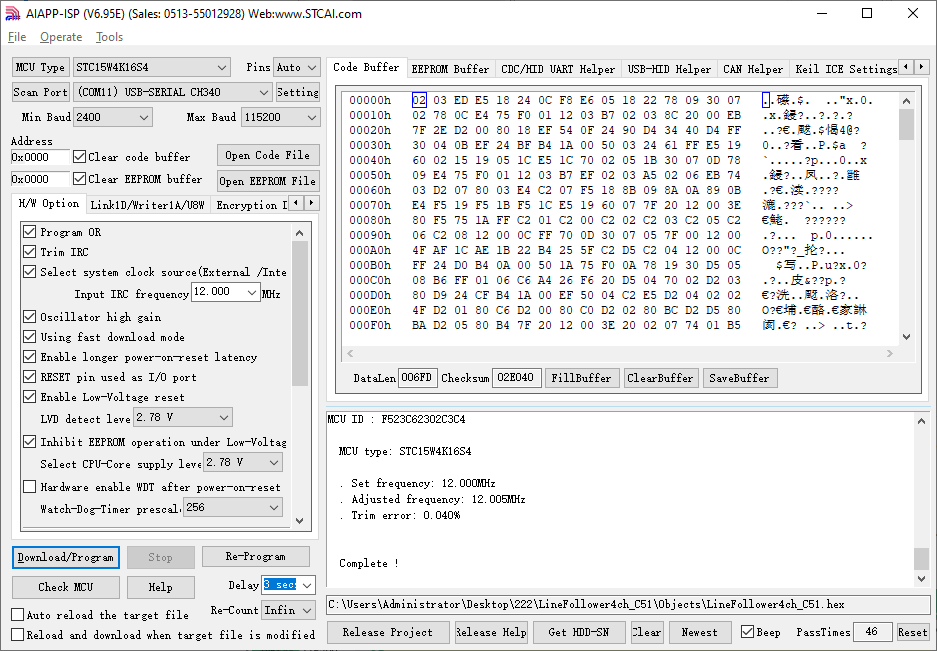

## 3.2 Test Example

This example uses the C51 development board to read the detection results from the 4-ch line follower sensor and print them through the serial port.

### 3.2.1 Program Outcome

After the development board is powered on, the recognition results from the four infrared probes are printed repeatedly through the serial port. If no black line is detected, the corresponding probe returns `0`. If a black line is detected, it returns `1`.

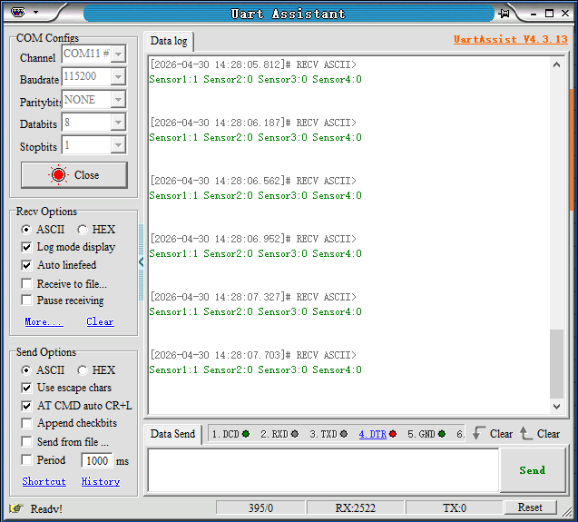

### 2.2 Program Analysis

1. The **include.h** library is imported. This library includes the **LineFollower4ch.h** data processing library for the 4-ch line follower sensor and the **IIC.h** software I2C library.

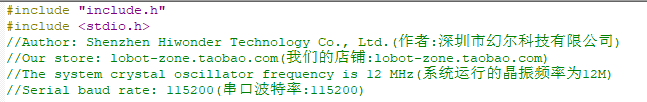

2. The serial port and I2C are initialized, and the serial baud rate is set to `115200`.

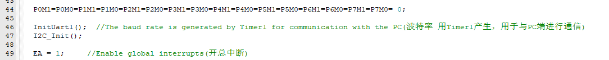

3. In the main function, a variable named `value` is created to store the detection result returned by the sensor. The result is obtained through the `read_line_follow()` function.

The detection result of the 4-ch line follower sensor is 1 byte long. Each of the lower four bits corresponds to the result from one probe. If no black line is detected, the corresponding probe returns `0`. If a black line is detected, it returns `1`.

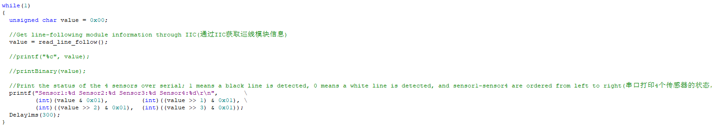