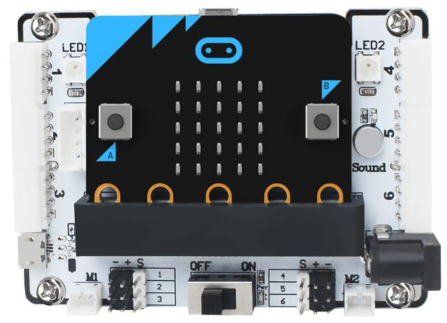
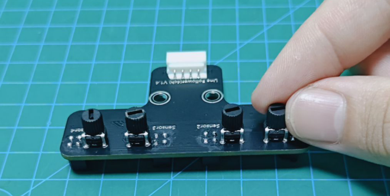
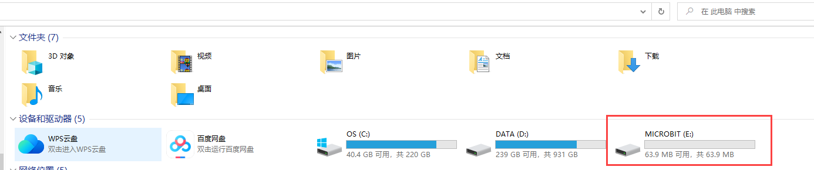
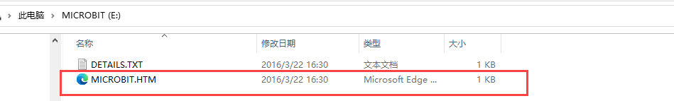
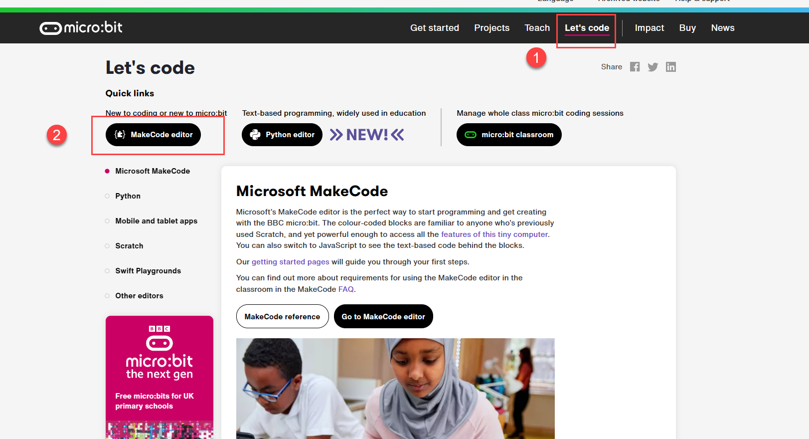
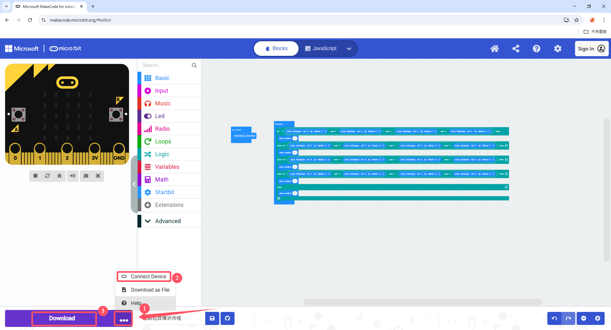

# 4. micro:bit Example

[TOC]

## 4.1 Preparation

This example uses a micro:bit board and a micro:bit expansion board. Connect the 4-ch line follower sensor to Port 4 on the micro:bit expansion board with a 4P cable.

| Pin  |               Description                |
| :--: | :--------------------------------------: |
|  5V  |               Power input                |
| GND  |               Power ground               |
| SDA  | Serial data transmission between devices |
| SCL  |          Clock pulse generation          |

> [!NOTE]
>
> **The detection distance can be adjusted with the knobs, allowing the sensitivity to be tuned for different environments. For calibration, first place the infrared probes over a black area and adjust the knobs until all blue indicator lights turn on. Then slowly rotate the knobs until the lights just turn off. Next, place the probes over a white area and continue adjusting until the lights just turn on. The probes are now set to the optimal sensitivity.**

## 4.2 Example Program

The 4-ch line follower sensor works by infrared detection. The sensor includes four probes, and each probe contains one receiver and one transmitter.

1. Connect the micro:bit to the computer with a data cable. A drive named **MICROBIT** will appear under **This PC**. Open the drive, then open the official micro:bit online programming platform.

   

   

2. After entering the website, click **Let's code** and then **MakeCode editor** to open the programming interface.

   

3. Drag the micro:bit program for this example directly into the webpage.

4. Connect the micro:bit board to any USB port on the computer. Click the option in the lower-left corner and follow the prompts to connect to the board. After the connection is complete, click **Download** to download the program to the micro:bit.

   

5. After the download is complete, insert the micro:bit board into the micro:bit expansion board, then connect the 4-ch line follower sensor to Port 4 on the expansion board.

## 4.3 Program Outcome

1. Prepare a sheet of white paper with a black line, or draw several black lines on white paper.

2. Aim the sensor probes at the black and white lines. The micro:bit board will display the number of the detected sensor channel on its LED matrix.