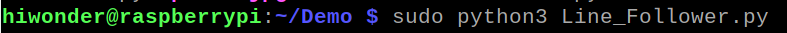
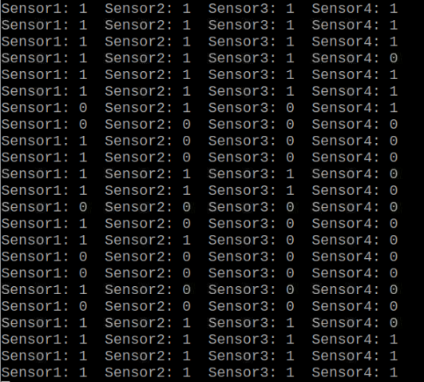
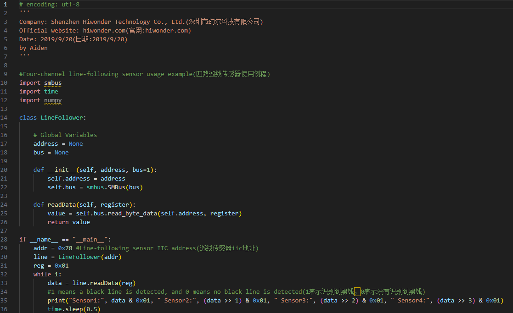

# 5. Raspberry Pi Example

[TOC]

## 5.1 Preparation

**1. Wiring and Interface Description**

This example uses a Raspberry Pi 4B with an expansion board. Connect the 4-ch line follower sensor to any SDA and SCL pin pair on the Raspberry Pi expansion board with a 4P cable.


| Pin  | Description  |
| :--: | :----------: |
|  5V  | Power input  |
| GND  | Power ground |
| SDA  | Serial data  |
| SCL  | Serial clock |

**2. Working Principle**

The 4-ch line follower sensor includes four probes. Each probe contains one receiver and one transmitter. After the transmitter emits infrared light, a white surface reflects the infrared light, while a black surface absorbs it. When the receiver detects reflected infrared light, the sensor LED turns on. When no reflected infrared light is detected, the sensor LED turns off.

**3. Sensitivity Adjustment**

The detection distance can be adjusted with the knobs, allowing the sensitivity to be tuned for different environments. For calibration, first place the infrared probes over a black area and adjust the knobs until all blue indicator lights turn on. Then slowly rotate the knobs until the lights just turn off. Next, place the probes over a white area and continue adjusting until the lights just turn on. The probes are now set to the optimal sensitivity, as shown in the figure.


## 5.2 Example Program

1. Use **VNC Viewer** on the computer to connect to the Raspberry Pi.

2. Use **MobaXterm** to upload the Raspberry Pi example program **Line_Follower.py** in the same directory as this document to the Raspberry Pi.

3. Run the program in the directory where **Line_Follower.py** is stored with the following command:

```bash
sudo python3 Line_Follower.py
```



## 5.3 Program Outcome

1. Prepare a sheet of white paper with a black line, or draw several black lines on white paper.

2. Aim the sensor probes at the black and white lines. The detected data from the four probes will be printed as `1` or `0`. When a probe detects a black line, the corresponding light turns off and the displayed value is `0`. When a probe detects a white area, the corresponding light turns on and the displayed value is `1`.

> [!NOTE]
>
> **This example is suitable for Mecanum-wheel, differential-drive, tank, and Ackermann chassis.**



## 5.4 Program Analysis

First, a read signal is sent to the sensor. After the sensor returns a response signal, the data is read and stored in the `data` variable. The received data is then printed bit by bit through the serial port. The program is shown in the figure below.


