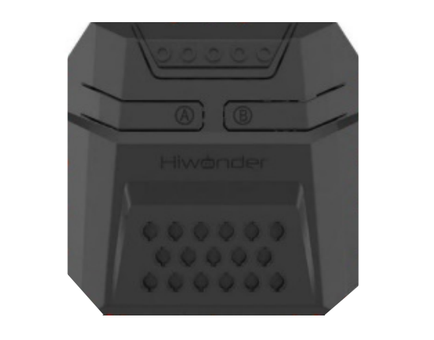
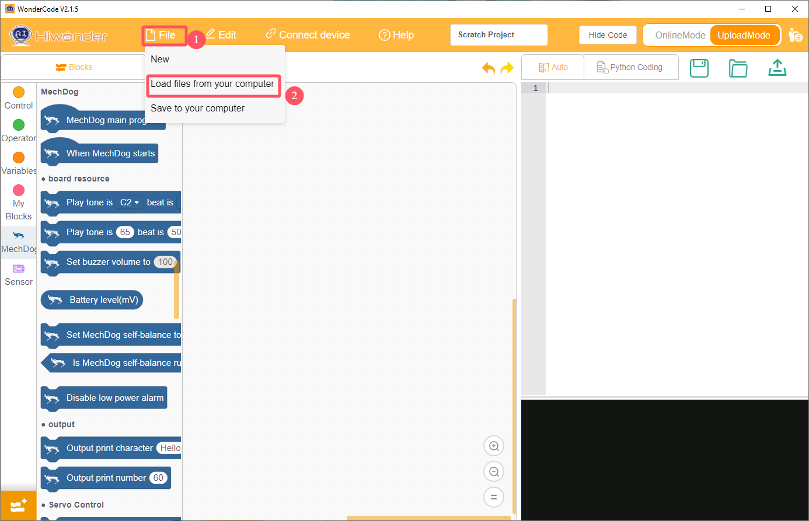
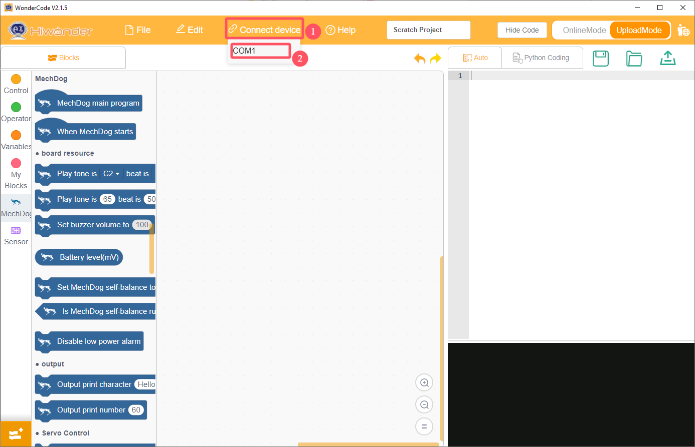
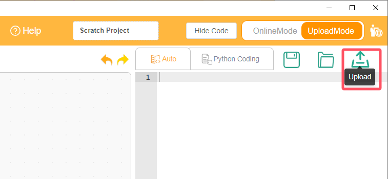

# 6. Scratch Example

[TOC]

## 6.1 Preparation

This example uses the CoreX controller and the 4-ch line follower sensor. Connect the sensor to Port 4 on the CoreX controller with a 4-pin cable.

| Pin  |               Description                |
| :--: | :--------------------------------------: |
|  5V  |               Power input                |
| GND  |               Power ground               |
| SDA  | Serial data transmission between devices |
| SCL  |          Clock pulse generation          |

> [!NOTE]
>
> **The detection distance can be adjusted with the knobs, allowing the sensitivity to be tuned for different environments. For calibration, first place the infrared probes over a black area and adjust the knobs until all blue indicator lights turn on. Then slowly rotate the knobs until the lights just turn off. Next, place the probes over a white area and continue adjusting until the lights just turn on. The probes are now set to the optimal sensitivity.**

## 6.2 Example Program

The 4-ch line follower sensor works by infrared detection. The sensor includes four probes, and each probe contains one receiver and one transmitter.

1. Click **WonderCode** to open the programming software.

2. Click **File** at the top of the software, then select **Load from Computer** to open the directory and import the program. The example program can also be dragged directly into the software window.

   

3. Connect the CoreX controller to the computer with a USB cable. Then check the COM port under **Connect** and click it to connect. **COM5** is used here as an example. Select the actual port shown on the computer.

4. After the connection is complete, click the download button in the upper-right corner to download the program to the CoreX controller.

   

## 6.3 Program Outcome

1. Prepare a sheet of white paper with a black line, or draw several black lines on white paper.

2. Aim the sensor probes at the black and white lines. When one of the sensors detects a black line, the CoreX controller lights up the corresponding color on its onboard LED.

For example, when Sensor 1 detects a black line, the LED turns red. When Sensor 2 detects a black line, the LED turns green. When Sensor 3 detects a black line, the LED turns blue. When Sensor 4 detects a black line, the LED turns white.