# 7. STM32 Example

[TOC]

## 7.1 Preparation

### 7.1.1 Wiring

During wiring, connect the 5V, GND, SDA, and SCL pins of the 4-ch line follower sensor with a 4-pin cable. The STM32F103 wiring setup is shown in the figure below.

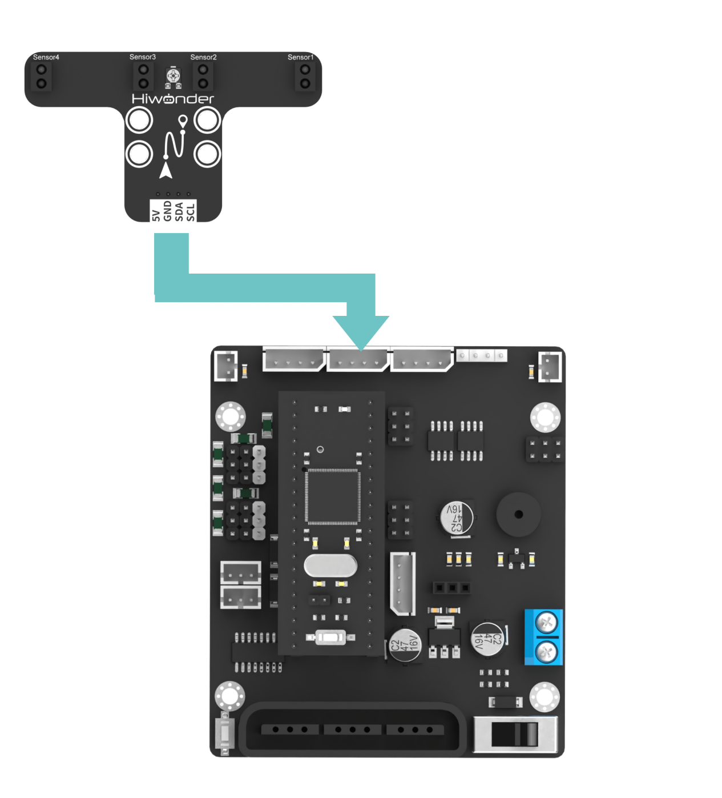

> [!NOTE]
>
> **Before powering on the board, make sure no metal object is in contact with the main board. Otherwise, the pins on the underside of the board may cause a short circuit and damage the board.**

### 7.1.2 Program Download

Before downloading the program, prepare an STM32F103 development board, an open-source robot car controller, Dupont wires, and a USB-to-TTL adapter.

**Download steps**

1. Connect the control board to any USB port on the computer through the USB-to-TTL adapter.

   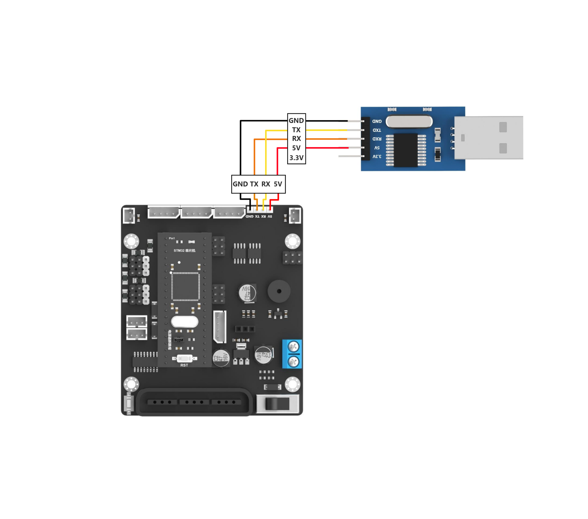

2. Double-click to open the [STM32 example program](https://drive.google.com/drive/folders/1Ciys_AZG9xLowNv5zUa3zfXm2QbC7Qu5?usp=sharing) in this folder.

   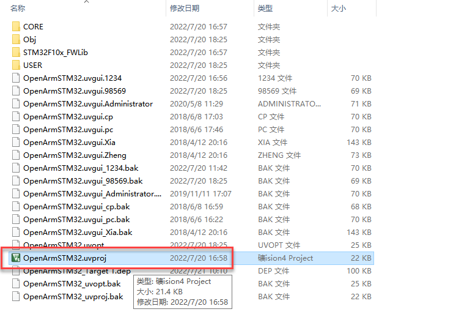

3. After opening the project, compile all code to generate the executable file.

   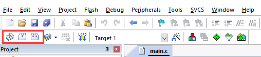

4. Remove the jumper cap from the STM32 development board, then press the **RST** reset button.

   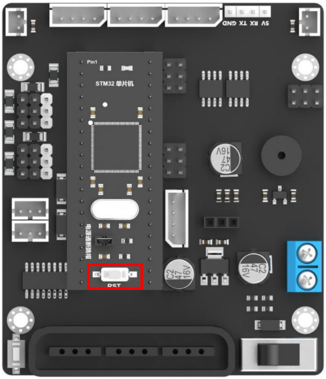

5. Open the programming tool, select the correct device port, and keep the baud rate unchanged. Then, flash the program to the development board as shown in the figure below.

   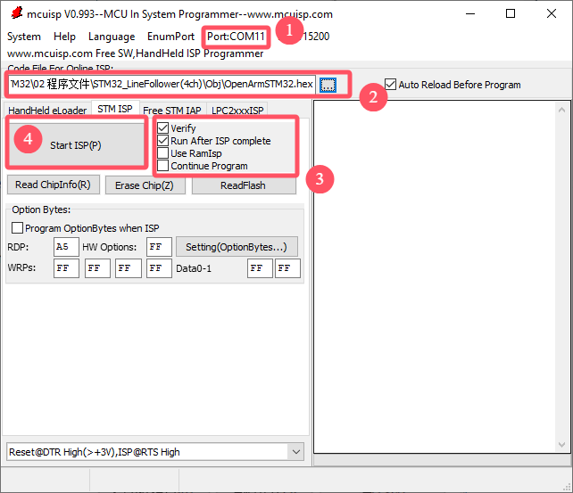

6. Click 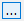to open the file in [Program\STM32_LineFollower(4ch)\Obj](https://drive.google.com/drive/folders/1oEuWdLLPcqwnhWbeB6ACEsDAAordNnS8?usp=sharing) under the same directory as this document.

   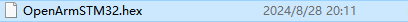

7. Then click **Start Programming** and wait for the download to complete.

   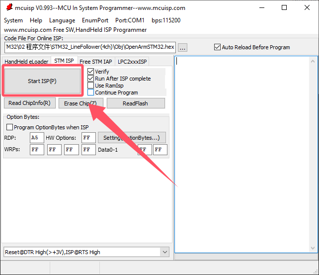

   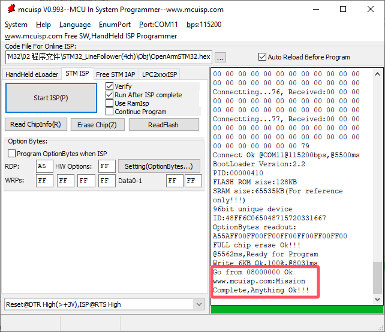

8. After the download is complete, reconnect the jumper cap to the STM32 development board, then press the **RST** button to run the program.

## 7.2 Test Example

This example uses the STM32F103 development board to read the detection results from the 4-ch line follower sensor and print them through the serial port.

### 7.3 Program Outcome

After the development board is powered on, the detection results from the four infrared probes are printed repeatedly through the serial port. If no black line is detected, the corresponding probe returns `0`. If a black line is detected, it returns `1`.

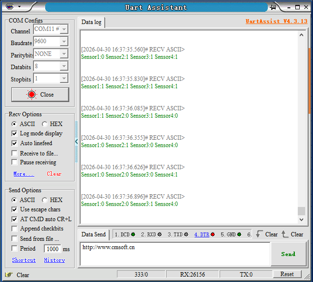

### 7.4 Program Analysis

1. The **include.h** library is imported. This library includes the **LineFollower4ch.h** data processing library for the 4-ch line follower sensor and the **IIC.h** software I2C library.

   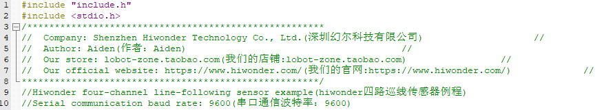

2. The serial port and I2C are initialized, and the serial baud rate is set to `9600`.

   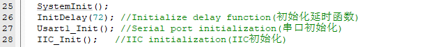

3. In the main function, a variable named `value` is created to store the detection result returned by the sensor. The result is obtained through the `read_line_follow()` function.

The detection result of the 4-ch line follower sensor is 1 byte long. Each of the lower four bits corresponds to the result from one probe. If no black line is detected, the corresponding probe returns `0`. If a black line is detected, it returns `1`.

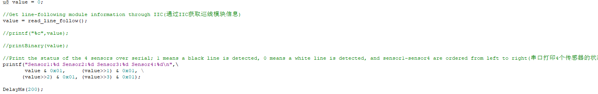